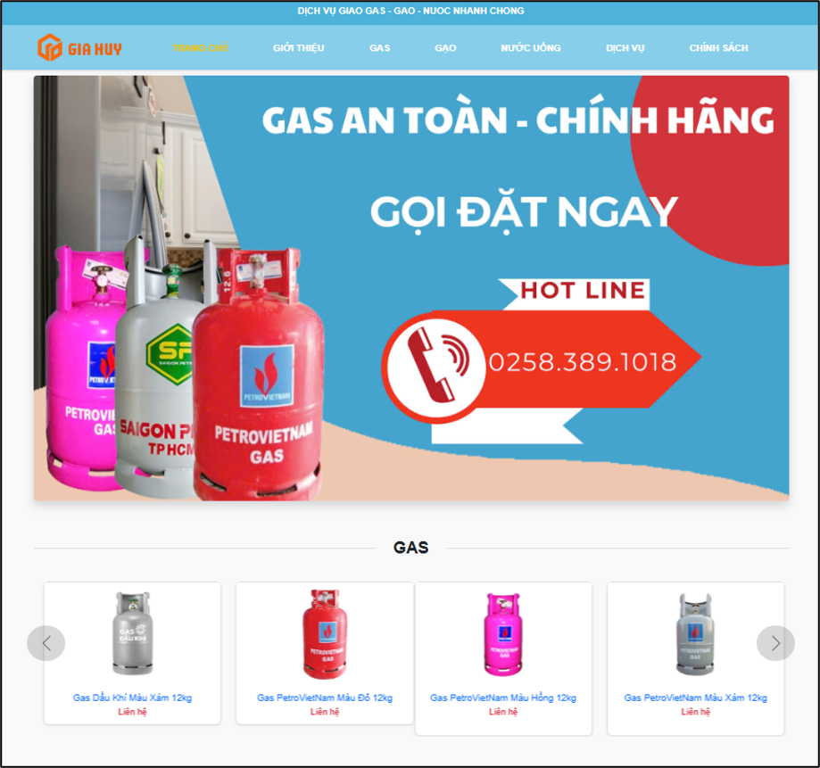
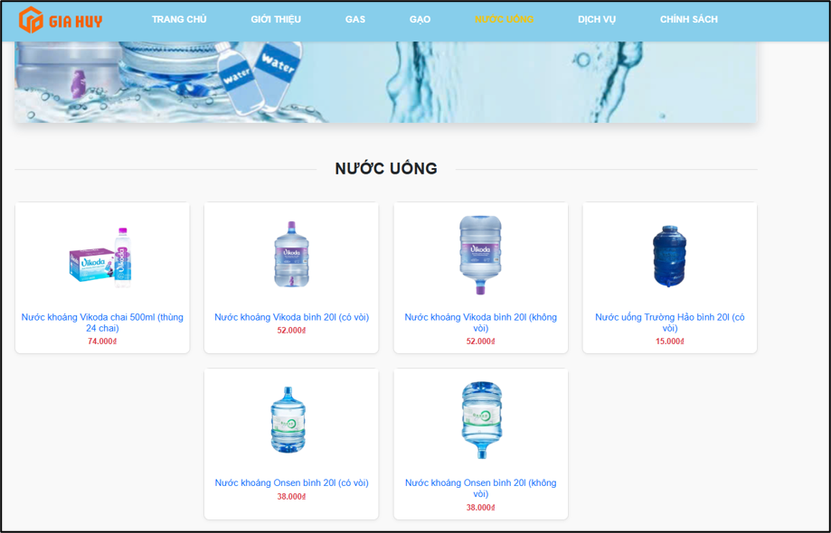
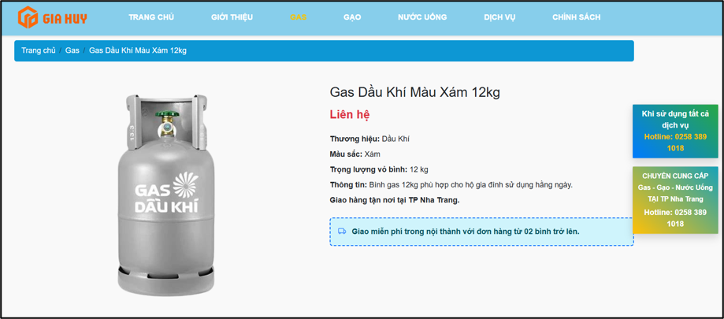
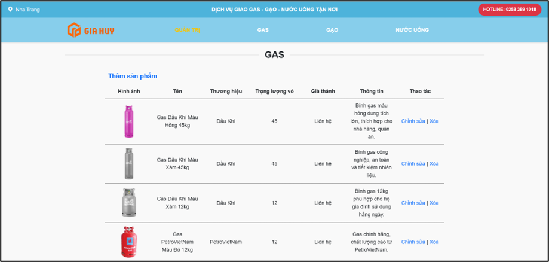

# Gas Agency Management System

Website quản lý và bán hàng cho Đại lý Gas Gia Huy — chuyên cung cấp **gas, gạo và nước uống** giao tận nơi tại khu vực Nha Trang. Hệ thống gồm trang bán hàng cho khách và trang quản trị (admin) để quản lý sản phẩm.

## Tính năng chính

**Trang khách hàng (Home)**
- Xem giới thiệu, chính sách, dịch vụ của đại lý
- Duyệt danh sách sản phẩm theo 3 nhóm: Gas, Gạo, Nước uống
- Xem chi tiết từng sản phẩm
- Tìm kiếm sản phẩm

**Trang quản trị (Admin)**
- Thêm / sửa / xóa sản phẩm cho từng nhóm hàng (Gas, Gạo, Nước uống)
- Xem chi tiết và quản lý toàn bộ danh sách sản phẩm

## Demo

### Trang chủ


### Danh mục sản phẩm
| Gạo | Nước uống |
|---|---|
|  |  |

### Chi tiết sản phẩm


### Trang quản trị


## Công nghệ sử dụng

- **Backend:** PHP thuần (Procedural PHP)
- **Database:** MySQL
- **Frontend:** HTML, CSS, JavaScript
- **Môi trường chạy:** XAMPP (Apache + MySQL)

## Cấu trúc thư mục

```
gas-agency-management-system/
├── admin.php              # Trang quản trị
├── home.php                # Trang chủ
├── css/                     # Style cho admin & trang chủ
├── js/                      # Script xử lý giao diện
├── html/                   # Các trang tĩnh (giới thiệu, chính sách, dịch vụ)
├── img/                     # Hình ảnh sản phẩm
├── php/                     # Xử lý logic: thêm/sửa/xóa/tìm kiếm sản phẩm
├── sql/                     # File cơ sở dữ liệu (DaiLyGiaHuy.sql)
└── README.md
```

## Hướng dẫn cài đặt và chạy thử

### Yêu cầu
- Đã cài [XAMPP](https://www.apachefriends.org/index.html) (Apache + MySQL)
- Trình duyệt web (Chrome, Firefox, Edge...)

### Các bước thực hiện

1. **Clone dự án về thư mục `htdocs` của XAMPP**
   ```bash
   git clone https://github.com/<username>/gas-agency-management-system.git
   ```
   Copy thư mục dự án vào `C:\xampp\htdocs\`

2. **Khởi động XAMPP**
   - Mở XAMPP Control Panel
   - Nhấn **Start** cho Apache và MySQL

3. **Import cơ sở dữ liệu**
   - Truy cập [phpMyAdmin](http://localhost/phpmyadmin)
   - Tạo database mới, đặt tên `dailygiahuy`
   - Import file `sql/DaiLyGiaHuy.sql`

4. **Kiểm tra cấu hình kết nối database**
   
   Mở file `php/connect.php` và kiểm tra/chỉnh lại thông tin kết nối cho phù hợp với máy của bạn:
   ```php
   $servername = "localhost";
   $username = "root";
   $password = "";
   $dbname = "dailygiahuy";
   ```

5. **Truy cập website**
   - Trang chủ: `http://localhost/gas-agency-management-system/home.php`
   - Trang quản trị: `http://localhost/gas-agency-management-system/admin.php`

### Xử lý lỗi thường gặp
- Kiểm tra log Apache tại `xampp/apache/logs/error.log`
- Kiểm tra lại thông tin kết nối trong `php/connect.php`
- Đảm bảo MySQL đang chạy và database đã được import đúng tên

## Thành viên thực hiện

| Họ và tên | Vai trò |
|---|---|
| Nguyễn Minh Nhật | Trưởng nhóm |
| Trần Thanh Thúy | Thành viên |
| Nguyễn Đăng Gia Huy | Thành viên |

## About

Dự án được phát triển trong quá trình học tập tại trường, nhằm thực hành xây dựng hệ thống quản lý bán hàng hoàn chỉnh với PHP và MySQL, bao gồm cả phần giao diện người dùng và trang quản trị.
